# s0sta — Web3 Security Researcher · Smart Contract Auditor · Solidity Developer

<p align="center">
  
</p>

> **I build DeFi-grade smart contracts from scratch — and I test them like an attacker.**


---

## About

Web3 security researcher and smart-contract developer focused on the EVM ecosystem. I design,
develop and audit Ethereum protocols — tokens, DeFi (AMMs, lending, staking), NFTs, DAO
governance, multisig and escrow — and ship each one with the engineering rigor an auditor
expects: **full test suites, fuzz testing, live attack PoCs, deploy scripts and CI.**

This repository is the proof: **10 complete protocols, every contract written from scratch**
(no OpenZeppelin, zero dependencies), **251 passing tests**, and a production-style dApp
live at [erc-20Token.s0sta.com](https://erc-20Token.s0sta.com).

## What I do

| Service | What you get |
|---|---|
| 🔐 **Smart-contract security auditing** | Manual line-by-line review, invariant & fuzz testing, exploit PoCs, severity-ranked findings |
| 🛠 **Smart-contract development** | Protocol design → implementation → deployment → verification, Foundry-first |
| 📐 **Protocol & tokenomics design** | DeFi math (AMM invariants, vesting, interest/liquidation), governance design |
| 🌐 **dApp frontends** | Wallet integration, admin panels, EIP-2612 UX, live on-chain feeds — deployable to any hosting |

## Security methodology

<p align="center">
  
</p>

Every audit and every build in this repo follows the same discipline:

1. **Specify invariants** — what must never break (supply caps, `x·y ≥ k`, pull-payment soundness, quorum math)
2. **Manual review** — reentrancy, access-control matrices, rounding direction, DoS vectors, flash-loan & MEV exposure, storage layout
3. **Automated testing** — Foundry unit + fuzz suites; time-travel (`vm.warp`), signature forging (`vm.sign`), pranking
4. **Attack PoCs** — write the exploit and prove the guard blocks it (e.g. live reentrancy attack contracts in 02 & 04, flash-vote-buying test in 09)
5. **Report** — findings with severity, exploit scenario, fix and regression test

## Portfolio — 10 protocols, easy → hard

| # | Project | What it is | Skills demonstrated | Difficulty | Tests |
|---|---------|-----------|--------------------|:---:|:---:|
| 01 | [ERC-20 Token](01-erc20-token) 🖥️ [live](https://erc-20Token.s0sta.com) | Supply-capped token: mint, burn, pause, EIP-2612 permit | ERC-20, ECDSA, EIP-712, access control | ★☆☆☆☆ | 31 ✅ |
| 02 | [Crowdfunding](02-crowdfunding) 🖥️ [live dApp](https://crowdfund.s0sta.com) | Kickstarter-style factory: pledge → claim/refund, platform fees | Factory pattern, pull payments, reentrancy defense | ★★☆☆☆ | 30 ✅ |
| 03 | [MultiSig Wallet](03-multisig-wallet) 🖥️ [live dApp](https://multisig.s0sta.com) | Gnosis-style N-of-M treasury with arbitrary calls | Multi-party auth, execution ordering, replay safety | ★★★☆☆ | 27 ✅ |
| 04 | [Escrow Service](04-escrow-service) 🖥️ [live dApp](https://escrow.s0sta.com) | Buyer/seller escrow with arbitration & fees | State machines, dispute resolution, fee accounting | ★★★☆☆ | 30 ✅ |
| 05 | [NFT Collection](05-nft-collection) 🖥️ [live dApp](https://nft.s0sta.com) | ERC-721 *from scratch*: Merkle whitelist, royalties, reveal | ERC-721 internals, Merkle proofs, ERC-2981 | ★★★☆☆ | 33 ✅ |
| 06 | [Staking Rewards](06-staking-rewards) 🖥️ [live dApp](https://stake.s0sta.com) | Synthetix-style time-weighted emissions | Accumulator math, checkpoints, O(1) rewards | ★★★★☆ | 26 ✅ |
| 07 | [Token Vesting](07-token-vesting) 🖥️ [live dApp](https://vesting.s0sta.com) | Cliff + linear vesting, revocable schedules | Time-based unlock curves, revocation accounting | ★★★☆☆ | 20 ✅ |
| 08 | [AMM DEX](08-amm-dex) 🖥️ [live dApp](https://dex.s0sta.com) | Uniswap-V2-style factory/pair/router, flash swaps | `x·y=k` math, LP accounting, multi-hop routing | ★★★★★ | 21 ✅ |
| 09 | [DAO Governance](09-dao-governance) | Snapshot voting power, quorum, on-chain execution | Checkpoint data structures, flash-loan defense | ★★★★★ | 16 ✅ |
| 10 | [Lending Protocol](10-lending-protocol) | Collateralized lending with interest & liquidations | Health factors, compounding interest, liquidation economics | ★★★★★ | 20 ✅ |

**Live deployment:** NovaToken on [Sepolia](https://sepolia.etherscan.io/address/0x26b420683E6F6Df39CFceBd7C5bB78B7459b8B62) · owner `0x3198…9B853` · frontend dApp at [erc-20Token.s0sta.com](https://erc-20Token.s0sta.com)

## Stats

| 10 protocols | 251 tests · 0 failures | ~60 Solidity files | 0 external dependencies | CI 10/10 green |
|---|---|---|---|---|

## Stack

**Languages & tooling** — Solidity 0.8.x (custom errors, NatSpec, checked math) · Foundry (unit/fuzz/invariant tests, deploy scripts, gas snapshots) · ethers.js v6 · Git/GitHub Actions CI · PHP/static hosting for dApps

**Standards** — ERC-20 · ERC-721 · ERC-165 · ERC-2981 · EIP-2612 · EIP-712 typed data

**Security patterns** — checks-effects-interactions · pull payments · reentrancy guards · two-step ownership · Merkle whitelists · snapshot voting · rounding-direction analysis

**DeFi math** — constant-product invariants & slippage · reward accrual with global accumulators · vesting curves · per-second compounding interest · health factors, close factors & liquidation bonuses

## Verify it yourself

```bash
# one-time
curl -L https://foundry.paradigm.xyz | bash && foundryup

# any project — build AND test (CI runs both, so should you)
cd 01-erc20-token
forge build && forge test        # or: make build && make test
forge snapshot                   # gas report
```

GitHub Actions runs `forge build` + `forge test` on all 10 projects for every push.

## Working together

I'm available for smart-contract audits, protocol development and security consultations.

- 📫 **GitHub:** [@s0sta](https://github.com/s0sta)
- 🌐 **Live work:** [erc-20Token.s0sta.com](https://erc-20Token.s0sta.com)

## Security note

This repository is portfolio work demonstrating engineering and security methodology. Each
project's README documents its design decisions and known trade-offs (the from-scratch
primitives intentionally mirror OpenZeppelin semantics). Production deployments with real
funds should use battle-tested libraries and an independent audit — see
[SECURITY.md](SECURITY.md).

## License

MIT — each project folder carries its own LICENSE file.
